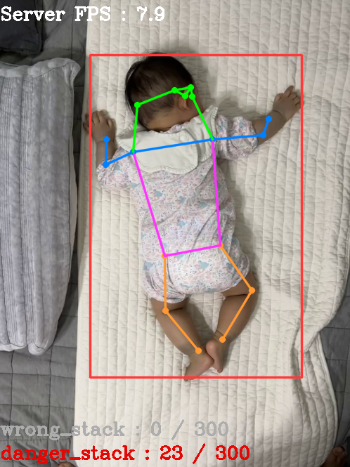

<h1 align="center">Infant Pose Detection</h1>

<p align="center">
</br>
<a href="https://www.gnu.org/licenses/agpl-3.0"></a>&nbsp
<a href="https://www.python.org/"></a>&nbsp
<a href="https://pjreddie.com/darknet/yolo/"></a>
</p>
</br>
<p align="center"><b>Infant Pose Detection with Raspberry Pi's Streaming System</b></p>

## News
- `2023/12/01`: 🏆 2023 공개SW 개발자대회 동상(큐브리드 대표상) 수상
- `2023/11/16`: 🏆 경기대학교 SW상상기업 프로그램 경진대회 우수상 수상
- `2023/11/02 - 2023/11/04`: 2023 SW인재 페스티벌 경기대학교 대표
- `2023/08/16`: 🏆 경기대학교 SW상상기업 프로그램 경진대회 우수 사업계획서상 수상
- `2023/06/14`: 🏆 경기대학교 2023 AI컴퓨터공학 산학협력 프로젝트 경진대회 대상 수상

<br>

## Introduction
* Predicts the baby's posture through Deep Learning - Pose Estimation technology and performs algorithm-based inappropriate posture detection based on the predicted posture.

* When inappropriate posture is detected, a notification is sent to the user's app.

* In this project, we used Raspberry Pi, camera module, [v4l2rtspserver](https://github.com/mpromonet/v4l2rtspserver) library as IoT means for video.

## Environment
The code is developed using python 3.10 on Ubuntu 22.04. NVIDIA GPUs are needed. The code is developed and tested using two NVIDIA RTX 2080 SUPER GPU card. Other platforms or GPU cards are not fully tested.

## Get Started
1. Clone this repository.
```shell
git clone https://github.com/LSTM2023/Infant-Pose-Detection
```

2. Set up a virtual environment such as venv or conda and install the requirements required.
```shell
python3 -m pip install -r requirements.txt
```

3. Make directory named firebase_cloud_messaging in '${Repo Root}/server_pose_estimation/firebase_cloud_messaging'.
```shell
mkdir firebase_cloud_messaging
```

4. Place the json file related to the FCM service account private key in the ${Repo Root}/server_pose_estimation/firebase_cloud_messaging for sending notifications .
```shell
${Repo Root}
├── raspberry_pi
└── server_pose_estimation
    └── firebase_cloud_messaging
        └── fcm_service_account_key.json
```

5. Create a file fcm.json, write it in the format shown below, and place it in the same directory, ${Repo Root}/server_pose_estimation/firebase_cloud_messaging.
```JSON
{
    "private_service_key": "fcm_service_account_key.json",
    "emul_TOKEN": "TOKEN of Emulator",
    "phone_TOKEN": "TOKEN of Phone Device",
    "tablet_TOKEN": "TOKEN of Tablet Device"
}
```
```shell
${Repo Root}
├── raspberry_pi
└── server_pose_estimation
    └── firebase_cloud_messaging
        ├── fcm_service_account_key.json
        └── fcm.json
```

6. Just run inference.py in the ${Repo Root}/server_pose_estimation directory.
```
python3 inference.py
```

7. You can check how inference progresses!</br>


## Model Fine-Tuning
### Data preparation
1. Please download SyRIP dataset from [here](https://github.com/ostadabbas/Infant-Pose-Estimation#data-preparation). Download and extract them under ${Repo_ROOT}/server_pose_estimation/fine_tuning/dataset with the name of 'SyRIP_COCO', and make them look like this:
```shell
${Repo Root}
├── raspberry_pi
└── server_pose_estimation
    └── fine_tuning
        └── dataset
            └── SyRIP_COCO
                ├── annotations
                ├── images
                └── README.md
```

2. Convert the dataset from coco format annotations to yolo format labels using coco_to_yolo.py in ${Repo_ROOT}/server_pose_estimation/fine_tuning/dataset. You can specify the dataset to be converted by changing the path name specified in the code. Then, you can check the .txt format files containing the labels for each image in a directory named yolo_labels.
```shell
python3 coco_to_yolo.py
```

3. Create a SyRIP_YOLO directory in ${Repo_ROOT}/server_pose_estimation/fine_tuning/dataset and place the images and labels to be used for train and validation in it as follows.
```shell
${Repo Root}
├── firebase_cloud_messaging
├── raspberry_pi
└── server_pose_estimation
    └── fine_tuning
        └── dataset
            ├── SyRIP_COCO
            └── SyRIP_YOLO
                ├── ${for_train}
                │   ├── images
                │   │   ├── train00001.jpg
                │   │   ├── train00002.jpg
                │   │   ├── ...
                │   │   └── train10999.jpg
                │   └── labels
                │       ├── train00001.txt
                │       ├── train00002.txt
                │       ├── ...
                │       └── train10999.txt
                └── ${for_valid}
                    ├── images
                    │   ├── test0.jpg
                    │   ├── test1.jpg
                    │   ├── ...
                    │   └── test499.jpg
                    └── labels
                        ├── test0.txt
                        ├── test1.txt
                        ├── ...
                        └── test499.txt
```

4. After that, modify the path in SyRIP-pose.yaml to match \${for_train} and \${for_valid}.
```yaml
train: ${for_train}  # train images
val: ${for_valid}  # val images
```

### Train and validation (Results)
* Just run train.py in the ${Repo Root}/server_pose_estimation/finetuning directory. You can edit You can edit You can edit You can edit You can edit You can edit 
```
python3 train.py
```

* And you can check the performance of each model through valid.py.
```
python3 valid.py
```

* In our case, fine-tuning was performed by reconstructing the existing dataset as follows.</br>


* The results of fine-tuning conducted with the reconstructed dataset are as follows.</br>


<!-- ## Directory Structure
```shell
${Repo Root}
├── raspberry_pi
│   ├── humid_temp_sensor
│   └── v4l2rtspserver
├── server_pose_estimation
│   ├── fine_tuning
│   │    ├── dataset
│   │    │   └── ...
│   │    ├── coco_to_yolo.py
│   │    ├── train.py
│   │    ├── valid.py
│   │    └── SyRIP-pose.yaml
│   ├── firebase_cloud_messaging
│   │   ├── fcm.json
│   │   └── fcm_service_account_key.json
│   ├── utils
│   │    ├── degrees_utils.py
│   │    ├── notification.py
│   │    ├── pose_utils.py
│   │    └── text_utils.py
│   ├── img_demo.py
│   └── inference.py
├── .gitignore
├── LICENSE
├── README.md
└── requirements.txt
``` -->

## How it works? (Pose Detection Algorithm)
We use [YOLOv8-pose model from ultralytics](https://docs.ultralytics.com/tasks/pose/) to estimate the baby's pose, and use the coordinates of each body joint obtained through this to detect the baby's abnormal sleeping posture. The image below is an abnormal sleeping posture detection algorithm, and a detailed description of the algorithm is described in ${Repo Root}/server_pose_estimation/utils/pose_utils.py.</br></br>
</br>

## Raspberry Pi
* We used Debian 10, Buster version of Raspberry Pi 4B model, and used [v4l2rtspserver](https://github.com/mpromonet/v4l2rtspserver) library to transmit video to the server and app.

* It is configured to measure temperature and humidity using the DHT11 sensor along with the camera module.

## License
Infant-Pose-Detection is released under the [AGPL-3.0 License](https://github.com/LSTM2023/Infant-Pose-Detection/blob/main/LICENSE).

## Citation
```bibtex
@inproceedings{huang2021infant,
  title={Invariant Representation Learning for Infant Pose Estimation with Small Data},
  author={Huang, Xiaofei and Fu, Nihang and Liu, Shuangjun and Ostadabbas, Sarah},
  booktitle={IEEE International Conference on Automatic Face and Gesture Recognition (FG), 2021},
  month     = {December},
  year      = {2021}
}
```
```bibtex
@software{Jocher_YOLO_by_Ultralytics_2023,
  author = {Jocher, Glenn and Chaurasia, Ayush and Qiu, Jing},
  license = {AGPL-3.0},
  month = jan,
  title = {{YOLO by Ultralytics}},
  url = {https://github.com/ultralytics/ultralytics},
  version = {8.0.0},
  year = {2023}
}
```
